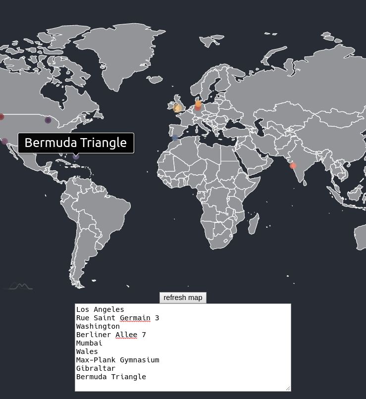

# GeoCoding Cache Service 

Small service that caches google maps geocoding results. When using the google maps api, you are allowed to cache some results for up to 30 days. https://cloud.google.com/maps-platform/terms/maps-service-terms

Just deploy this applicaton somewhere and send your geocoding requests here to store the results compliant to the google terms of service.

## A simple demo
Displaying maps with pins for specific locations is a common use case. Just put your [maps geocoding API key](https://developers.google.com/maps/documentation/geocoding/get-api-key) in the `application.properties` and use `mvn spring-boot:run` to start the application. check out the map at http://localhost:8080 and edit the locations.

 
 # Weigher 
 You can choose to limit cache capacity by (estimated) memory consumption instead of limiting the number of entries. The demo also shows cache2ks EvictionListener and statistics. [Public Demo](https://weigher.azurewebsites.net/)
 
 Use `mvn spring-boot:run` to start the application, then go to http://localhost:8080
 

 
 
 
